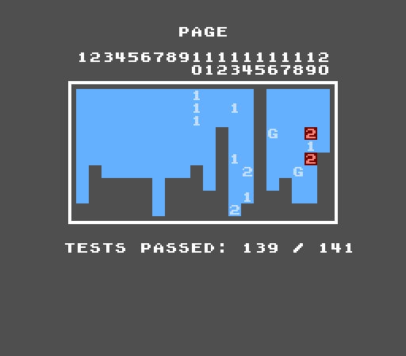

+++
title = 'Introspection Is the Work'
date = 2026-08-30
description = "Every project has some way of seeing what it's doing. Almost all of it was built for a person, and that's now the wrong shape."
tags = ['Java', 'AI-Agents', 'Emulation']
+++

Writing code got cheap. Checking it didn't.

When an agent does most of the typing, what limits you isn't how well you describe the task. It's whether your program can tell you what it just did. If it can't, you're back to reading every change yourself, with the whole domain in your head. You saved some typing and nothing else.

So the work moved. It moved out of the feature and into introspection: the plumbing that lets something outside the program find out what happened inside it.

Most projects already have some of this: a debugger, a log, a dashboard, a screen. The problem is that all of it was built for a person, and the one asking questions now isn't a person.

## A person and an agent need different things

The difference matters, because "add better logging" isn't the answer.

When you debug, you have eyes, context, and patience. You look at a screenshot and know right away that the colors are wrong. You scroll a log, poke at a REPL, follow a hunch in a debugger for ten minutes. You know what the program is supposed to do, so a vague signal is enough. You'll recognize the problem when you see it.

An agent has none of that. It asks a question and gets one answer, in text. It can't squint at a picture and think "hmm, that looks off". It can't wander around and notice things. Whatever it needs has to be written in the output, in a form it can compare with something else.

So introspection built for an agent has a different shape:

- It works without a window, a mouse, or a session.
- It says things instead of showing them.
- It's structured, so two outputs can be compared by a machine.
- It's complete in one shot, because there's no scrolling around.
- It can turn into a pass or a fail, because that's what a script acts on.

None of this is hard. It's just work nobody was doing, because until recently the only reader was a person, and a person can cope with almost anything.

## Describing a picture to something with no eyes

I've been building [MyNES](https://github.com/dimiro1/mynes), a NES emulator in Java. Old console emulators aren't new to me; I wrote a [Game Boy emulator in C++](https://github.com/dimiro1/GameBoyCPP) back in 2010. What's new this time is the way of working: most of MyNES was built by directing an agent. It's a good example because it's the hardest case I can think of. An emulator's output is a picture and a sound. There's nothing to assert on. It either looks like Super Mario Bros. or it doesn't, and "looks like" is exactly the judgment an agent can't make.

To be clear, the tests were never the problem. The NES has an amazing test suite that I didn't write a line of: [Tom Harte's tests](https://github.com/SingleStepTests/65x02) cover all 256 opcodes with the exact bus traffic on every cycle, [blargg's ROMs](https://www.nesdev.org/wiki/Emulator_tests) pin VBlank and NMI timing down to a single PPU clock, and [AccuracyCoin](https://github.com/100thCoin/AccuracyCoin) is one cartridge with 141 scored tests that draws its own results table.



That's thirty years of other people's work, and it's why the CPU and the timing went so fast. But it only covers the parts of a NES that are arithmetic. It says nothing about whether the game looks right, whether it made a sound, or whether it ever got past its own title screen. The rest of this post is about that gap. Most software lives in that gap all the time.

Here's what I ended up building, and the rule behind each piece.

## If it only exists in a menu, it doesn't exist

Everything runs headless. No window, no sound card, every capability behind a flag:

```sh
java -jar mynes.jar --headless --rom smb.nes --frames 900 \
    --input 60/40x3:start --screenshot 300,last --audio --dump ram
```

The debugger too. Breakpoints, watchpoints, single stepping, a disassembler, a full instruction trace: all of it works from the command line, not just from the window. Same for the nametable and sprite viewers. There are windows for me, and `--dump nametables,oam` for the agent, both reading the same state. Every human view has a machine-readable twin.

There's a rule hiding here that I keep relearning: **a flag survives a refactor, a private field doesn't.** More on that later.

## Describe the picture in numbers

Every run writes a `report.json` that describes the picture in terms a program can use:

- a hash of the visible 224 lines
- how many colors the frame has, and which ones
- whether the whole frame is one flat color, which is what a machine that never started looks like
- how many frames were different from the frame before them

Agents can read a PNG now, and the emulator does write them. But an image is a bad answer to most questions. You can't diff it, you can't do it for nine hundred frames, and "does this look right?" gets you a confident opinion instead of a fact. A hash and four numbers are cheap, exact, and comparable. Use the picture when you really need to see it, not as the main channel.

The last number on that list turned out to be the most useful one. It's the difference between "the game is running" and "the game is sitting on its title screen forever", and it's how I learned that most games never start on their own. Super Mario Bros., Super Mario Bros. 3, and Tetris will all sit on the title screen for as long as you let them. Only Super Mario Bros. 2 starts playing by itself. A run with no input is a run of the menu, and an APU that looks dead is usually a game nobody asked to play.

## One data model, two renderings

There's an interactive mode that takes commands on standard input and answers each one. You can pipe a whole session into it:

```sh
printf 'run 60\npress start\nrun-until-change 300\nstate\nquit\n' \
  | java -jar mynes.jar --headless --rom smb.nes --interactive
```

`--format auto` prints readable text when a terminal is attached and compact JSON when the output is a pipe. Same data, rendered twice, depending on who's reading. I didn't want two code paths that could drift apart, and I didn't want the agent parsing prose.

The commands are shaped around questions, not views. `run-until-change 300` answers "on which frame does something happen?", a question I ask all the time and one that no window can answer without me sitting there watching.

## Make two runs comparable

One measurement is almost useless. What you want is two.

Nothing in the emulator reads a clock or a random number, so the same ROM with the same input produces the same bytes on every run, on every computer. Everything that legitimately varies, like wall clock time, Java version, and working directory, goes under a `host` key. That means a whole run can be compared with a previous one in a single line:

```sh
diff <(jq 'del(.host)' before.json) <(jq 'del(.host)' after.json)
```

This is the piece I underrated for the longest time. It turns "did my change break something?" from something you remember into something you diff. Determinism is usually sold as a correctness property, but it's just as valuable as an observability property.

## Turn an observation into an exit code

Measurements are for humans. Exit codes are for scripts.

So three of those numbers became assertions: `--expect-not-blank`, `--expect-audio`, `--expect-motion N`. A run that doesn't hold them exits with code 4. Now "did my last change break Mario?" is a question a script can ask, which means it can be answered without me.

This is the part that surprised me: **the introspection became the test suite**, not the other way around. Nobody was ever going to write a test ROM for "Super Mario Bros. looks right". But once the emulator could measure itself, the assertions fell out of the measurements almost for free. Every time I tried the opposite order, writing the tests first and adding observability later, I got tests that assert whatever the code already does.

## If you don't build it, the agent builds a worse one

Here's the thing that convinced me introspection is worth building on purpose.

An agent that can't see into the program doesn't stop and ask for help. It needs to check its work, so it improvises a way to do it with whatever is around. In a project like this, "whatever is around" means reading the Swing window's private fields, or taking a photo of the whole desktop with `java.awt.Robot`. That kind of improvised introspection works exactly once. It breaks on the next refactor, and it can't run at all on a machine with no display.

So the choice was never between having introspection and not having it. The agent will always find some way to look. The only choice is whether it looks through something you designed, or through something it improvised five minutes ago.

That's also why the project's `CLAUDE.md` starts with a section called "Seeing what the emulator does": use headless mode, here are the flags, don't reach into private fields, don't photograph the screen. The introspection only counts if the agent knows it's there.

## Arguing with a wrong test

One more thing that only works because you can look inside.

MMC3's scanline counter is covered by six test ROMs, and the emulator passes five. The sixth, `6-MMC3_alt`, is turned off on purpose. It tests the revision A counter, and it contradicts the fifth one by design. No real chip passes both.

Give an agent a failing test and it will fix it. That's what it's for. It would happily have "fixed" this one into a wrong implementation, reported six out of six, and everything would be green while the emulator got worse.

The only reason I know it's a trap is that I can see what the counter is actually doing, and I read the readme that ships next to the ROM. A test you can't look behind is just an authority. Introspection is what lets you disagree with one.

## For the next project

Introspection used to be a nice-to-have, the thing you add after a bug gets embarrassing. Now it's the limit. How fast an agent can help you depends on how well your program can explain itself, and that limit is something you build.

The checklist:

1. Build the introspection before the feature, not after the bug.
2. Every capability gets a non-interactive entry point. If it only exists in a UI, it doesn't exist.
3. Describe what the reader can't see. Numbers and hashes beat images and prose.
4. Make two runs comparable: keep the core deterministic and put everything that varies in one place.
5. Turn the useful observations into exit codes.
6. Tell the agent where all of it lives, or it will improvise something worse.
